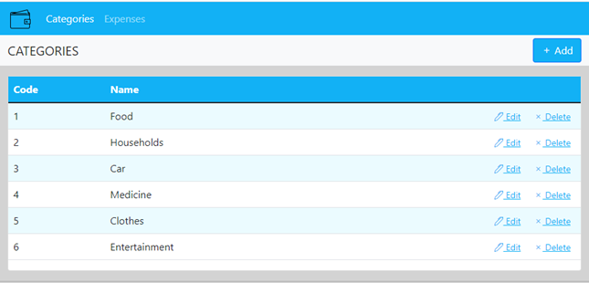
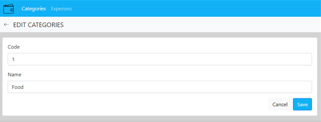
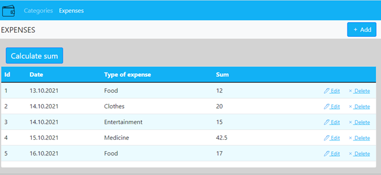
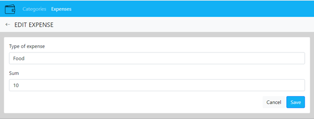

# Home expenses assistant

## Purpose
Required to create web app to work with family expenses. The application must implement the following functions:
* View, add and edit expense categories (e.g. food, fuel, medicine, etc.).
* View, add and edit the list of expenses.
* Ability to view expenses for a selected period of time.

### 1. Categories of expenses
   This program mode is intended for viewing a list of expense categories.

Main scenario:
* The user selects the (***Categories***) menu item; 
* The form for viewing the list of expense categories is displayed.

Figure 1.1 - list of expense categories.

The list displays the following columns:
* Code - expense category code;
* Name - the name of the expense.

#### 1.1 Adding a new expense category
Main scenario:
* User clicks “Add” button;
* The form for adding a new expense category is displayed;
* The user enters data and clicks the (***Save***) button;
* If the data is entered incorrectly, or the entered expense category code already exists, then an error message is displayed;
* The entered data is saved to the database;
* If the data has been successfully added, the form for viewing the category of expenses opens;
* If the user clicks the (***Cancel***) button, the data is not saved and the form for viewing the category of expenses is displayed.

Figure 1.2 - adding a new expense category.

#### 1.2 Editing expense category
Main scenario:
* The user clicks the "Edit" button in the line of the selected category;
* The editing form with the entered initial data of the current expense category is displayed;
* The user changes the data and clicks the (***Save***) button;
* If the data is entered incorrectly, or the entered expense category code already exists, then an error message is displayed;
* The entered data is saved to the database;
* If the data has been successfully added, the form for viewing the category of expenses opens;
* If the user clicks the (***Cancel***) button, the changes are not saved and the form for viewing the category of expenses is displayed.

Figure 1.3 - editing the category of expenses.

#### 1.3 Deleting an expense category
Main scenario:
* The user clicks the (***Delete***) button in the line of the selected category;
* The selected category of expense is deleted in the database;
* The updated form for viewing the category of expenses is displayed.

### 2. List of expenses 
This program mode is intended for viewing a list of expenses.

Main scenario:
* The user selects the (***Expenses***) menu item;
* The form for viewing the list of expenses is displayed.

Figure 2.1 - list of expenses.

The list displays the following columns:
* Id - serial number of the expense;
* Date - the date of the expense;
* Kind of expense - the name of the category of expense;
* Amount - the amount spent.

#### 2.1 Adding a new expense
Main scenario:
* User clicks (***Add***) button;
* The form for adding a new expense is displayed;
* The user enters the data and clicks the (***Save***) button;
* If the data is entered incorrectly, then an error message is displayed;
* The entered data is saved to the database;
* If the data has been successfully added, the form for viewing the list of expenses opens;
* If the user clicks the (***Cancel***) button, the data is not saved and the form for viewing the list of expenses is displayed.

Figure 2.2 - adding a new expense.

#### 2.2 Editing the list of expenses
Main scenario:
* User presses the (***Edit***) button in the line of the selected expense;
* The editing form with the entered initial data of the current expense is displayed;
* The user changes the data and clicks the (***Save***) button;
* If the data is entered incorrectly, then an error message is displayed;
* The entered data is saved to the database;
* If the data has been successfully added, the form for viewing the list of expenses opens;
* If the user clicks the (***Cancel***) button, the changes are not saved and the form for viewing the list of expenses is displayed.

Figure 2.3 - editing the list of expenses.

#### 2.3 Deleting an expense field
Main scenario:
* User presses the (***Delete***) button in the line of the selected expense field;
* The selected expense is deleted in the database;
* The updated form for viewing the list of expenses is displayed.

#### 2.4 Calculation of the amount of expenses
Main scenario:
* The user clicks the button (***Calculate sum***);
* The form for calculating the amount of expenses is displayed;
* The user selects the required period of time for which the amount of expenses will be calculated;
* By default, a list of expenses for the entire period of time is displayed.
* User clicks refresh button;
* A table with the final amounts for each category of expenses is displayed, as well as the total amount for all categories of expenses.

Figure 2.4 - calculation of the amount of expenses.
