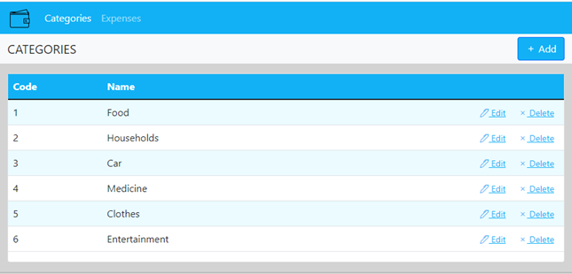
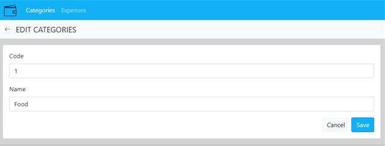
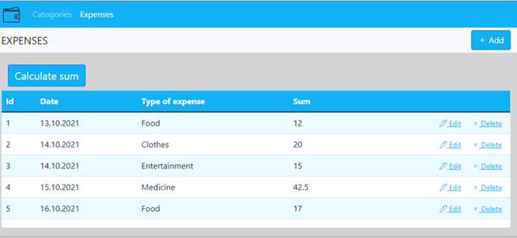
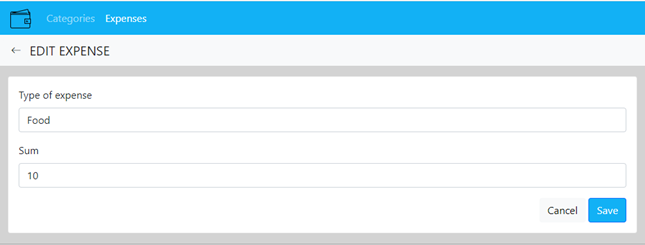
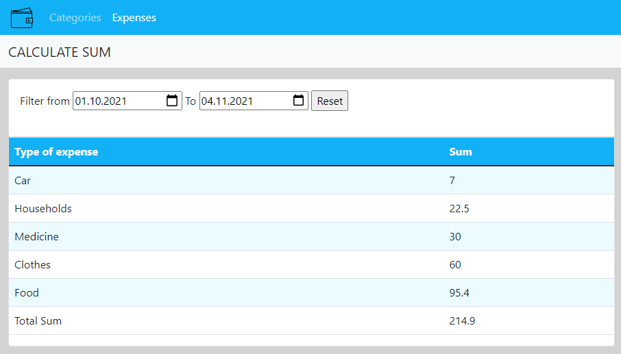

# Домашний помощник учета расходов

## Видение
Требуется создать Web приложение для работы с семейными расходами. Приложение должно реализовывать следующие функции:
* Просмотр, добавление и редактирование категории расходов (например, питание, топливо, медицина и т. д.).
* Просмотр, добавление и редактирование списка расходов.
* Возможность просмотра расходов за выбранный промежуток времени.

### 1. Категории расходов
   Данный режим программы предназначен для просмотра списка категорий расходов.

Основной сценарий:
* Пользователь выбирает пункт меню “Категории расходов” (***Categories***);
* Отображается форма просмотра списка категорий расходов.

Рисунок 1.1 – список категорий расходов.

В списке отображаются следующие колонки:
* Код – код категории расхода;
* Наименование – наименование расхода.

#### 1.1 Добавление новой категории расхода
Основной сценарий:
* Пользователь нажимает кнопку ***Add***;
* Отображается форма добавления новой категории расхода;
* Пользователь вводит данные и нажимает кнопку ***Save***;
* Если данные введены не корректно, либо введенный код категории расходов уже существует, то выводится сообщение об ошибке;
* Введенные данные сохраняются в базу данных;
* Если данные успешно добавлены, то открывается форма просмотра категории расходов;
* Если пользователь нажимает кнопку ***Cancel***, то данные не сохраняются и отображается форма просмотра категории расходов.

Рисунок 1.2 – добавление новой категории расходов.

#### 1.2 Редактирование категории расхода
Основной сценарий:
* Пользователь нажимает кнопку ***Edit*** в строке выбранной категории;
* Отображается форма редактирования с введенными исходными данными текущей категории расхода;
* Пользователь изменяет данные и нажимает кнопку ***Save***;
* Если данные введены не корректно, либо введенный код категории расходов уже существует, то выводится сообщение об ошибке;
* Введенные данные сохраняются в базу данных;
* Если данные успешно добавлены, то открывается форма просмотра категории расходов;
* Если пользователь нажимает кнопку ***Cancel***, то изменения не сохраняются и отображается форма просмотра категории расходов.

Рисунок 1.3 – редактирование категории расходов.

#### 1.3 Удаление категории расхода
Основной сценарий:
* Пользователь нажимает кнопку ***Delete*** в строке выбранной категории;
* Происходит удаление выбранной категории расходов в базе данных;
* Отображается обновленная форма просмотра категории расходов.

### 2. Список расходов
Данный режим просмотра программы предназначен для просмотра списка расходов.

Основной сценарий:
* Пользователь выбирает пункт меню “Список расходов” ***(Expenses)***;
* Отображается форма просмотра списка расходов.

Рисунок 2.1 – список расходов.

В списке отображаются следующие колонки:
* Номер п/п – порядковый номер расхода;
* Дата – дата осуществления расхода;
* Вид расхода – наименование категории расхода;
* Сумма – затраченная сумма.

#### 2.1 Добавление нового расхода
Основной сценарий:
* Пользователь нажимает кнопку ***Add***;
* Отображается форма добавления нового расхода;
* Пользователь вводит данные и нажимает кнопку ***Save***;
* Если данные введены не корректно, то выводится сообщение об ошибке;
* Введенные данные сохраняются в базу данных;
* Если данные успешно добавлены, то открывается форма просмотра списка расходов;
* Если пользователь нажимает кнопку ***Cancel***, то данные не сохраняются и отображается форма просмотра списка расходов.

Рисунок 2.2 – добавление нового расхода.

#### 2.2 Редактирование списка расходов
Основной сценарий:
* Пользователь нажимает кнопку ***Edit*** в строке выбранного расхода;
* Отображается форма редактирования с введенными исходными данными текущего расхода;
* Пользователь изменяет данные и нажимает кнопку ***Save***;
* Если данные введены не корректно, то выводится сообщение об ошибке;
* Введенные данные сохраняются в базу данных;
* Если данные успешно добавлены, то открывается форма просмотра списка расходов;
* Если пользователь нажимает кнопку ***Cancel***, то изменения не сохраняются и отображается форма просмотра списка расходов.

Рисунок 2.3 – редактирование списка расходов.

#### 2.3 Удаление расхода
Основной сценарий:
* Пользователь нажимает кнопку ***Delete*** в строке выбранного расхода;
* Происходит удаление выбранного расхода в базе данных;
* Отображается обновленная форма просмотра списка расходов.

#### 2.4 Расчет суммы расходов
Основной сценарий:
* Пользователь нажимает кнопку "рассчитать сумму расходов" ***(calculate sum)***;
* Отображается форма расчета суммы расходов;
* Пользователь выбирает необходимый период времени, за который будет подсчитана сумма расходов;
* По умолчанию отображается список расходов за весь период времени.
* Пользователь нажимает кнопку обновления;
* Выводится таблица с конечными суммами по каждой категории расходов, а также итоговая сумма по всем категориям расходов. 

Рисунок 2.4 – расчет суммы расходов.